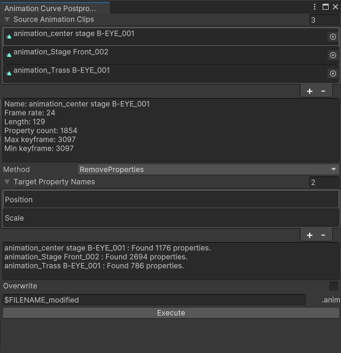

# AnimationCurvePostprocessor

## Overview

A tool for Unity to apply any process to AnimationCurves.

It works by starting the tool window from `Tools/AnimationCurvePostprocessor`, selecting AnimationClip, and choosing the process want to apply.

Multiple AnimationClips can be processed simultaneously, with the option to overwrite or save as.

## Installation

This asset can be installed using the Unity Package Manager (UPM).

No packages are required for installation.

### From git URL

Open `Window > Package Manager` and click the + sign in the upper left corner to display `Add package from git URL...`
You can install the latest version by typing `https://github.com/kuyuri-iroha/AnimationCurvePostprocessor.git?path=/AnimationCurvePostprocessor/Assets/AnimationCurvePostprocessor` in the input field that appears when you click to install the latest version.

## Unity Version & Dependencies

Development version：2021.1.0

## Collaborator

- [murasaqi](https://github.com/murasaqi)

## LICENSE

[MIT License](./LICENSE)
